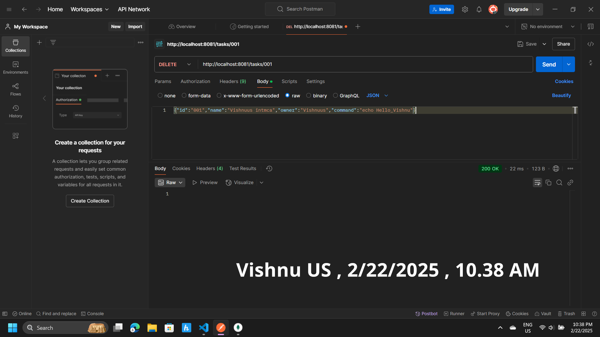

# Task 1 - Java REST API for Task Management

## Overview
This project implements a robust Java backend REST API using Spring Boot and MongoDB to manage "task" objects. Each task represents a shell command that can be created, searched, deleted, and executed, with execution details (start time, end time, and output) stored in a MongoDB database. The API adheres to RESTful principles and includes validation to prevent unsafe/malicious commands.

## Prerequisites
To compile, run, and use this application, ensure the following are installed on your system:
- **Java 17** or higher (verify with `java -version`)
- **Maven** (verify with `mvn -version`)
- **Docker** (for running MongoDB, verify with `docker --version`)
- **Postman** (for testing API endpoints, download from [postman.com](https://www.postman.com/downloads))

## Installation and Setup
2. Start MongoDB
Launch MongoDB using Docker
To Run:
docker run -d -p 27017:27017 mongo

Alternatively, if MongoDB is already running, ensure it’s active with:
Run this :
docker start mongodb

3. Build the Project
Navigate to the project directory and build it using Maven:
To Run:
mvn clean install

4. Run the Application
Start the Spring Boot application:
To Run:
mvn spring-boot:run

The application will be accessible at http://localhost:8081 (configurable in src/main/resources/application.properties).

### API Endpoints
The following REST endpoints are available for interacting with tasks. Use Postman to test these endpoints, as demonstrated in the screenshots. Below are step-by-step instructions for each endpoint in Postman.

1. GET /tasks
Description: Retrieves all tasks or a specific task by ID (optional id parameter).

Postman Instructions:

Method: GET
URL: http://localhost:8081/tasks (for all tasks) or http://localhost:8081/tasks?id=001 (for a specific task)
Headers: None required
Body: None required
Send: Click "Send" in Postman to retrieve tasks.
Response: Returns a JSON array or object of tasks (e.g., [{"id":"001","name":"Vishnuus intmca","owner":"Vishnuus","command":"echo Hello_Vishnu","taskExecutions":[]}]).

Screenshot:
.png>)
.png>)

2. PUT /tasks
Description: Creates or updates a task. The request body must be a JSON object with id, name, owner, and command fields. Commands are validated to block unsafe/malicious code (e.g., "rm" or "sudo").

Postman Instructions:

Method: PUT
URL: http://localhost:8081/tasks
Headers: Add Content-Type: application/json
Body: Select "raw" and enter:

{"id":"001","name":"Vishnuus intmca","owner":"Vishnuus","command":"echo Hello_Vishnu"}

Send: Click "Send" in Postman to create or update the task.
Response: Returns the created or updated task in JSON format.
Screenshot:

3. DELETE /tasks/{id}
Description: Deletes a task by its ID.

Postman Instructions:

Method: DELETE
URL: http://localhost:8081/tasks/001
Headers: None required
Body: None required
Send: Click "Send" in Postman to delete the task.
Response: Returns 200 OK if successful, or 404 Not Found if the task doesn’t exist.
Screenshot:

4. GET /tasks?name={string}
Description: Searches for tasks where the name contains the provided string (case-sensitive).

Postman Instructions:

Method: GET
URL: http://localhost:8081/tasks?name=Vishnuus
Headers: None required
Body: None required
Send: Click "Send" in Postman to search for tasks.
Response: Returns a JSON array of matching tasks.

Screenshot:
_BY_NAME.png)

5. PUT /tasks/{id}/execute
Description: Executes the shell command of a task, stores execution details (start time, end time, and output) in taskExecutions, and returns the updated task.

Postman Instructions:

Method: PUT
URL: http://localhost:8081/tasks/001/execute
Headers: None required
Body: None required
Send: Click "Send" in Postman to execute the task.
Response: Returns the task with updated taskExecutions (e.g., {"output":"Hello_Vishnu"}).

Screenshot:

Screenshots
All screenshots demonstrate the input (requests) and output (responses) for each endpoint in Postman, including my name ("Vishnuus") and the current date/time for verification. The screenshots are stored in the screenshots folder and linked above.

### Video Demonstration
Watch a video demonstrating the execution of all tasks for Task 1:
In this video it covers Contains all the execution of task one by one
- **Download Video to watch (if under 100MB)**: <video controls src="All_Task_Execution_Video.mp4" title="Title"></video>

Notes
The application uses MongoDB to persist tasks. Ensure MongoDB is running on localhost:27017.
Commands are validated to prevent unsafe operations, enhancing security.
This documentation adheres to Kaiburr’s requirement for high-quality code and documentation, prioritized for clarity and professionalism.

Contact
For questions or feedback, contact Vishnuus at [vishnuus934@gmail.com] 

=======
